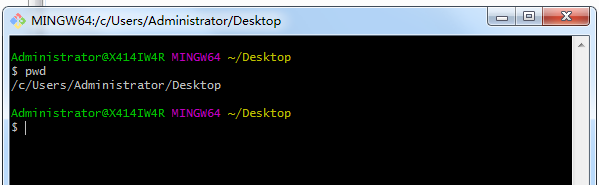
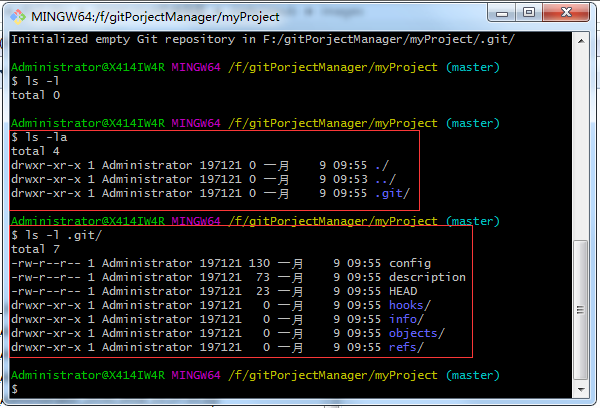

# gitAndgitHub

是什么？

官网：https://git-scm.com/

官网介绍：

> Git--distributed-is-the-new-centralized
>
> Git is a [free and open source](https://git-scm.com/about/free-and-open-source) distributed version control system designed to handle everything from small to very large projects with speed and efficiency.
>
> Git is [easy to learn](https://git-scm.com/doc) and has a [tiny footprint with lightning fast performance](https://git-scm.com/about/small-and-fast). It outclasses SCM tools like Subversion, CVS, Perforce, and ClearCase with features like [cheap local branching](https://git-scm.com/about/branching-and-merging), convenient [staging areas](https://git-scm.com/about/staging-area), and [multiple workflows](https://git-scm.com/about/distributed).

Git(读音为/gɪt/)是一个开源的**分布式版本控制系统**，可以有效、高速地处理从很小到非常大的项目版本管理。 Git 是 Linus Torvalds 为了帮助管理 Linux 内核开发而开发的一个开放源码的版本控制软件。

Torvalds 开始着手开发 Git 是为了作为一种过渡方案来替代 BitKe 

## 1.下载安装

官网下载地址：https://www.git-scm.com/download/

### 0.windows版本安装

双击下载的文件：Git-2.20.1-64-bit.exe  进行安装即可

### 1.Linux版本安装

Linux官方安装说明:https://git-scm.com/download/linux

> 对于下面的Linux发行版本官网的安装说明如下
>
> Red Hat Enterprise Linux, Oracle Linux, CentOS, Scientific Linux, et al.
>
> RHEL and derivatives typically ship older versions of git. You can [download a tarball](https://www.kernel.org/pub/software/scm/git/) and build from source, or use a 3rd-party repository such as [the IUS Community Project](https://ius.io/) to obtain a more recent version of git.


### 2.Git结构

工作区(新建、修改的文件)、暂存区(git add 后)、本地仓库(git commit 后)

### 3.初始化

管理工具：

图形界面:Git GUI Here

命令行:Git Bash Here

1. git 安装完成后，在任何目录下右键,可看到Git GUI Here与Git Bash Here菜单，这里使用命令行进行操作，进入命令行窗口后可使用Linux命令，如查看下当前位置：pwd



2. 新建一个git项目的文件夹，如：在F盘下新建gitProjectManager文件夹，命令如下：

``` she

mkdir /f/gitProjectManager
--跳转到gitProjectManager目录下
cd /f/gitProjectManager/
--再新建一个存放项目的文件夹，比如myProject
```

3. 在` cd /f/gitPorjectManager/myProject/`目录下执行 ` git init` 命令进行初始化

``` shell
Administrator@X414IW4R MINGW64 /f/gitPorjectManager/myProject
$ git init
Initialized empty Git repository in F:/gitPorjectManager/myProject/.git/

初始化命令执行后会新建一个.git的隐藏文件夹，如下图
```



### 4.设置签名

- 形式：用户名与email

- 作用：区分开发人员的身份

- 注意：这里设置的签名与远程库(代码托管中心)的账号与密码没有任何关系

- 级别：项目级别/仓库级别 与系统用户级别

  1. 项目级别/仓库级别：仅在当前本地仓库范围内有效

  ``` she
  --签名，email可以随便写，只是为了区分开发人员身份用，哪怕不存在的邮箱都行
  git config user.name jinshengyuan
  git config user.email jinshengyuan@dev.com
  
  --签名的保存位置: .git/config 文件中
  即在：/f/gitPorjectManager/myProject/.git/config 文件中
  ```

  签名后使用命令：`cat /f/gitPorjectManager/myProject/.git/config`查看签名信息，如下：

  ``` shell
  Administrator@X414IW4R MINGW64 /f/gitPorjectManager/myProject (master)
  $ cat /f/gitPorjectManager/myProject/.git/config
  [core]
          repositoryformatversion = 0
          filemode = false
          bare = false
          logallrefupdates = true
          symlinks = false
          ignorecase = true
  [user]
          name = jinshengyuan
          email = jinshengyuan@dev.com
  
  ```


  2. 系统用户级别：登录当前操作系统的用户范围

  ``` she
  --签名：
  git config --global user.name jinshengyuan
  git conifg --global user.email jinshengyuan@dev.com
  
  --签名保存位置： ~/.gitconfig	
  即在Windows系统的/c/user/administrator/.gitcofnig 文件中	
  ```

  系统用户级别签名后可使用`cat ~/.gitconfig`命令进行查看签名信息

  ```shell
  Administrator@X414IW4R MINGW64 /f/gitPorjectManager/myProject (master)
  $ cat ~/.gitconfig
  [user]
          name = jinshengyuan
          email = jisnhengyuan@dev.com
  
  ```

  3. 级别的优先级：

  就近原则：项目级别/仓库级别优先于系统用户级别，二者有时都采用项目级别的签名；

  如果只有系统用户级别的签名，则就以系统级别的签名为准；

  二者一定是二选一，不允许二者都无签名的情况；

## 2.基础操作

### 1.基本操作命令

1. 状态查看，查看工作区暂存区状态等

命令 `git status`

2. 添加：将工作区新增或修改的文件添加到暂存区中

命令 `git add [fileName]`

3. 将暂存区中的文件从工作目录中丢弃，也就是撤销或修改后的文件操作

命令 `git checkout -- [fileName]`【注意：-- 与fileName 之间有个空格】

4. 提交：将暂存区中的文件提交到本地仓库中

命令 `git commit [file name]` 使用此命令提交，会弹出vim编辑器让填写提交信息，如果提交时直接添加提交的信息，可以使用 命令 `git commit -m "commit message info" fileName`

### 2.查看历史记录

1. 查看所有提交过的历史记录信息
   命令：`git log`

``` shell
$ git log
commit 16c2b3fd19bcc84abdefaea0b08741e86bb75606 (HEAD -> master)
Author: jinshengyuan <jinshengyuan@dev.com>
Date:   Wed Jan 9 16:36:33 2019 +0800
    update提交

commit e22c44fe0af6c594251f580664df86858142e1ec
Author: jinshengyuan <jinshengyuan@dev.com>
Date:   Wed Jan 9 15:28:26 2019 +0800

    test文件第二版提交

commit 128d03ed6704a6d6210e57a08db583491349ea16
Author: jinshengyuan <jinshengyuan@dev.com>
Date:   Wed Jan 9 15:22:52 2019 +0800

    test文件第一版提交
```

2. 只查看提交文件时写的“提交信息”历史记录
   命令：`git reflog` 

``` shell
$ git reflog
16c2b3f (HEAD -> master) HEAD@{0}: commit: update提交
e22c44f HEAD@{1}: commit: test文件第二版提交
128d03e HEAD@{2}: commit (initial): test文件第一版提交
```

3. `git log --pretty=oneline`

```shell
$ git log --pretty=oneline
16c2b3fd19bcc84abdefaea0b08741e86bb75606 (HEAD -> master) update提交
e22c44fe0af6c594251f580664df86858142e1ec test文件第二版提交
128d03ed6704a6d6210e57a08db583491349ea16 test文件第一版提交
```

4. `git log --oneline`

``` shell
Administrator@X414IW4R MINGW64 /f/gitPorjectManager/myProject (master)
$ git log --oneline
16c2b3f (HEAD -> master) update提交
e22c44f test文件第二版提交
128d03e test文件第一版提交
```


## 3.Git远程仓库操作

1. 创建远程仓库地址别名

- 查看所有远程库地址别名

```shell
git remote -v 
```

- 创建远程库地址并指定别名

```shell
git remote add [别名] GitHub地址，如
git remote add origin https://github.com/userName/xxx.git
```

2. 将本地仓库中的分支推送至GitHub上

```shell
git push [别名]/[远程库地址] [分支]
git push origin master 
```

3. 将GitHub上的地址克隆到本地仓库

```shell
git clone [远程库地址]
git clone https://github.com/userName/xxx.git
```

- 如果我们需要克隆到指定的目录，可以使用以下命令格式：

```shell
git clone [远程仓库地址] [本地目录]
```


- 注意，如果不指定别名，从GitHub中clone远程仓库时，默认的别名就是origin，如

```shell
git clone https://github.com/userName/xxx.git
```

4. 拉取

```shell
git pull [远程库地址或别名] [远程分支]
git pull origin master

git fetch [远程库地址或别名] [远程分支]

git merge [远程库地址或别名] [远程分支]

pull = fetch + merge

```


