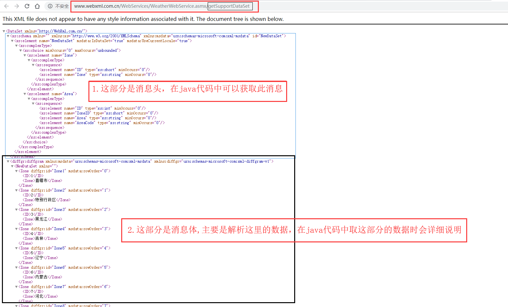

# WebService开发笔记

## JDK自带的 JAX-WS 方式开发WebService服务

### 1.服务端开发与发布

1. 编写接口

``` java
@WebService
public interface JaxWsDemo {
    String helloJaxWS(String userName);
}
```

2. 编写接口的实现类

``` java
@WebService
public class JaxWsDemoImpl implements JaxWsDemo {
    @WebMethod
    @WebResult(name = "jaxWSResult")
    @Override
    public String helloJaxWS(@WebParam(name = "userName")String userName) {
        return "hello," + userName + "This is a Web Service developed through JAX-WS";
    }
}
```

3. 发布服务

``` java
public class JAXWSPublishMain {
    public static void main(String[] args) {
        String address = "http://127.0.0.1:8888/JaxWSTest";
        Endpoint.publish(address,new JaxWsDemoImpl());
        System.out.println("WebService 服务已发布！");
    }
```

4. 访问已发布的WebService服务

打开浏览器输入http://127.0.0.1:8888/JaxWSTest?wsdl访问，如下面内容


截图内容1

``` xml
<!--
 Published by JAX-WS RI (http://jax-ws.java.net). RI's version is JAX-WS RI 2.2.9-b130926.1035 svn-revision#5f6196f2b90e9460065a4c2f4e30e065b245e51e. 
-->
<!--
 Generated by JAX-WS RI (http://jax-ws.java.net). RI's version is JAX-WS RI 2.2.9-b130926.1035 svn-revision#5f6196f2b90e9460065a4c2f4e30e065b245e51e. 
-->
<definitions xmlns:wsu="http://docs.oasis-open.org/wss/2004/01/oasis-200401-wss-wssecurity-utility-1.0.xsd" xmlns:wsp="http://www.w3.org/ns/ws-policy" xmlns:wsp1_2="http://schemas.xmlsoap.org/ws/2004/09/policy" xmlns:wsam="http://www.w3.org/2007/05/addressing/metadata" xmlns:soap="http://schemas.xmlsoap.org/wsdl/soap/" xmlns:tns="http://wsimpl.jaxws/" xmlns:xsd="http://www.w3.org/2001/XMLSchema" xmlns="http://schemas.xmlsoap.org/wsdl/" targetNamespace="http://wsimpl.jaxws/" name="JaxWsDemoImplService">
<types>
<xsd:schema>
<xsd:import namespace="http://wsimpl.jaxws/" schemaLocation="http://127.0.0.1:8888/JaxWSTest?xsd=1"/>
</xsd:schema>
</types>
<message name="helloJaxWS">
<part name="parameters" element="tns:helloJaxWS"/>
</message>
<message name="helloJaxWSResponse">
<part name="parameters" element="tns:helloJaxWSResponse"/>
</message>
<portType name="JaxWsDemoImpl">
<operation name="helloJaxWS">
<input wsam:Action="http://wsimpl.jaxws/JaxWsDemoImpl/helloJaxWSRequest" message="tns:helloJaxWS"/>
<output wsam:Action="http://wsimpl.jaxws/JaxWsDemoImpl/helloJaxWSResponse" message="tns:helloJaxWSResponse"/>
</operation>
</portType>
<binding name="JaxWsDemoImplPortBinding" type="tns:JaxWsDemoImpl">
<soap:binding transport="http://schemas.xmlsoap.org/soap/http" style="document"/>
<operation name="helloJaxWS">
<soap:operation soapAction=""/>
<input>
<soap:body use="literal"/>
</input>
<output>
<soap:body use="literal"/>
</output>
</operation>
</binding>
<service name="JaxWsDemoImplService">
<port name="JaxWsDemoImplPort" binding="tns:JaxWsDemoImplPortBinding">
<soap:address location="http://127.0.0.1:8888/JaxWSTest"/>
</port>
</service>
</definitions>
```

浏览器中输入wsdl文档中的 http://127.0.0.1:8888/JaxWSTest?xsd=1可查看绑定的参数等信息看如下图：


截图内容2 

``` xml
<!--
 Published by JAX-WS RI (http://jax-ws.java.net). RI's version is JAX-WS RI 2.2.9-b130926.1035 svn-revision#5f6196f2b90e9460065a4c2f4e30e065b245e51e. 
-->
<xs:schema xmlns:tns="http://wsimpl.jaxws/" xmlns:xs="http://www.w3.org/2001/XMLSchema" version="1.0" targetNamespace="http://wsimpl.jaxws/">
<xs:element name="helloJaxWS" type="tns:helloJaxWS"/>
<xs:element name="helloJaxWSResponse" type="tns:helloJaxWSResponse"/>
<xs:complexType name="helloJaxWS">
<xs:sequence>
<xs:element name="userName" type="xs:string" minOccurs="0"/>
</xs:sequence>
</xs:complexType>
<xs:complexType name="helloJaxWSResponse">
<xs:sequence>
<xs:element name="jaxWSResult" type="xs:string" minOccurs="0"/>
</xs:sequence>
</xs:complexType>
</xs:schema>
```

### 2.客户端开发与测试


## Axis1.4调用.Net返回值为DataSet类型的WebService接口

## 1.相关说明

1. JDK版本：1.8.0_172
2. axis版本：Axis1.4

## 2. Axis1.4客户端WebService服务

### 1.Axis1.4下载

1. 官网：http://axis.apache.org/axis/
2. 下载后是一个压缩文件：axis-bin_1.4.zip
3. 非maven环境，则导入axis-bin_1.4.zip包下的lib目录下的所有jar包，如下图：


4.maven环境的话，在pom.xml中添加下面的依赖即可

```xml
<!--Axis1.4 及其依赖 begin-->
        <!-- https://mvnrepository.com/artifact/org.apache.axis/axis -->
        <dependency>
            <groupId>org.apache.axis</groupId>
            <artifactId>axis</artifactId>
            <version>1.4</version>
        </dependency>
        <!-- https://mvnrepository.com/artifact/jaxrpc/jaxrpc -->
        <!-- https://mvnrepository.com/artifact/axis/axis-jaxrpc -->
        <dependency>
            <groupId>axis</groupId>
            <artifactId>axis-jaxrpc</artifactId>
            <version>1.4</version>
        </dependency>
        <!-- https://mvnrepository.com/artifact/axis/axis-ant -->
        <dependency>
            <groupId>axis</groupId>
            <artifactId>axis-ant</artifactId>
            <version>1.4</version>
        </dependency>
        <!-- https://mvnrepository.com/artifact/axis/axis-saaj -->
        <dependency>
            <groupId>axis</groupId>
            <artifactId>axis-saaj</artifactId>
            <version>1.4</version>
        </dependency>
        <!-- https://mvnrepository.com/artifact/wsdl4j/wsdl4j -->
        <dependency>
            <groupId>wsdl4j</groupId>
            <artifactId>wsdl4j</artifactId>
            <version>1.6.3</version>
        </dependency>

        <!-- https://mvnrepository.com/artifact/commons-discovery/commons-discovery -->
        <dependency>
            <groupId>commons-discovery</groupId>
            <artifactId>commons-discovery</artifactId>
            <version>0.5</version>
        </dependency>
        <!--Axis1.4 及其依赖 end-->
		<!-- 引入dom4j 解析数据时用-->
 <!-- https://mvnrepository.com/artifact/org.dom4j/dom4j -->
        <dependency>
            <groupId>org.dom4j</groupId>
            <artifactId>dom4j</artifactId>
            <version>2.1.1</version>
        </dependency>
```

### 2.WebService服务接口地址及方法

1. 地址：http://www.webxml.com.cn/WebServices/WeatherWebService.asmx
2. 调用的方法：http://www.webxml.com.cn/WebServices/WeatherWebService.asmx/getSupportDataSet



### 3.编写调用WebService服务的方法及数据解析

1. 编写调用WebService服务的客户端java类,并打印结果，类名为：Axis1_Client

```java
package com.yuan;


import org.apache.axis.client.Call;
import org.apache.axis.client.Service;
import org.apache.axis.encoding.XMLType;
import org.apache.axis.message.MessageElement;
import org.apache.axis.types.Schema;
import org.dom4j.Document;
import org.dom4j.DocumentException;
import org.dom4j.DocumentHelper;
import org.dom4j.Element;
import org.junit.Test;

import javax.xml.namespace.QName;
import java.net.URL;
import java.util.Iterator;
import java.util.List;

/**
 * Created by IntelliJ IDEA.
 * User: jinshengyuan
 * Date: 2019-01-15
 * Time: 15:13
 * description:
 **/
public class Axis1_Client {
    /**
     * 使用dom4j解析数据
     */
    @Test
    public void axisWSInvoke(){
        String dataSetDataStr = axisInvokeNetDataSetData();
        //System.out.println(dataSetDataStr);
        if(dataSetDataStr != null){
            try {
                Document doc = DocumentHelper.parseText(dataSetDataStr);// 将字符串转为XML
                Element root = doc.getRootElement();// 获取根节点
                Iterator iterator =  root.elementIterator("Zone");//迭代节点
                String id,zone;
                while(iterator.hasNext()){
                  Element element = (Element) iterator.next();
                  id = element.elementTextTrim("ID");//取出Zone节点下的ID元素的值
                  zone = element.elementTextTrim("Zone");//取出Zone节点下的Zone元素的值
                    System.out.println("Id:"+id+"=============================Zone:"+zone);
                }
            } catch (DocumentException e) {
                e.printStackTrace();
            }

        }
    }

    /**
     * 调用.Net写的返回值为DataSet类型的WebService服务
     * @return
     */
    public String axisInvokeNetDataSetData(){
        Service service = new Service();
        String strXml = null;
        Call call = null;
        try {
            call = (Call) service.createCall();
            call.setTargetEndpointAddress(new URL("http://www.webxml.com.cn/WebServices/WeatherWebService.asmx"));//WSURL，注意不要带?wsdl
            //调用方法方法前设置相关参数
            call.setOperationName(new QName("http://WebXml.com.cn/", "getSupportDataSet"));
            call.setReturnType(XMLType.XSD_SCHEMA);//返回类型，这里一定要传入 XMLType.XSD_SCHEMA 类型
            call.setUseSOAPAction(true);
            call.setSOAPActionURI("http://WebXml.com.cn/getSupportDataSet");//soapAction
            Object obj = call.invoke((Object[]) null);
            Schema schema = (Schema) obj;
            MessageElement[] messageElements = schema.get_any();
            List messageHead = messageElements[0].getChildren();//消息头,DataSet对象
            List messageBody = messageElements[1].getChildren();//消息体信息,DataSet对象,最终需要解析的数据
            if (messageBody.size() > 0) {
                String head = messageHead.get(0).toString();//消息头,DataSet对象
                String diffgr = messageBody.get(0).toString();//消息体的字符串形式
                strXml = diffgr;
                System.out.println("head:\n"+head);
                System.out.println("diffgr:\n" + diffgr);
            }
        } catch (Exception e) {
            e.printStackTrace();
        }
        return strXml;
    }
}
```

2. 输出结果：

```java
Id:1=============================Zone:直辖市
Id:2=============================Zone:特别行政区
Id:3=============================Zone:黑龙江
Id:4=============================Zone:吉林
Id:5=============================Zone:辽宁
Id:6=============================Zone:内蒙古
Id:7=============================Zone:河北
Id:8=============================Zone:河南
Id:9=============================Zone:山东
Id:10=============================Zone:山西
Id:11=============================Zone:江苏
Id:12=============================Zone:安徽
Id:13=============================Zone:陕西
Id:14=============================Zone:宁夏
Id:15=============================Zone:甘肃
Id:16=============================Zone:青海
Id:17=============================Zone:湖北
Id:18=============================Zone:湖南
Id:19=============================Zone:浙江
Id:20=============================Zone:江西
Id:21=============================Zone:福建
Id:22=============================Zone:贵州
Id:23=============================Zone:四川
Id:24=============================Zone:广东
Id:25=============================Zone:广西
Id:26=============================Zone:云南
Id:27=============================Zone:海南
Id:28=============================Zone:新疆
Id:29=============================Zone:西藏
Id:30=============================Zone:台湾
Id:31=============================Zone:亚洲
Id:32=============================Zone:欧洲
Id:33=============================Zone:非洲
Id:34=============================Zone:北美洲
Id:35=============================Zone:南美洲
Id:36=============================Zone:大洋洲
```

